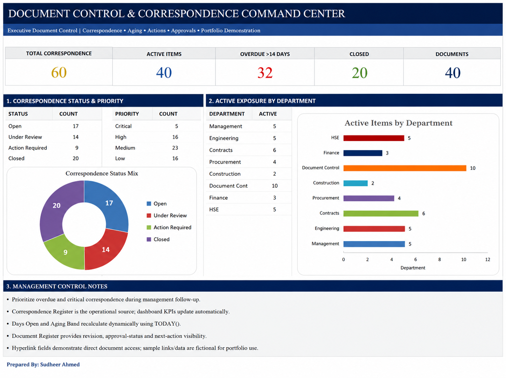

# Document Control & Correspondence Command Center

  

  <strong>Developed by: Sudheer Ahmed Khattak</strong> 
  Project Operations & Business Support Professional

---

## Executive Summary

The **Document Control & Correspondence Command Center** is an executive reporting dashboard developed to provide project leadership with complete visibility into document control activities, correspondence management, approvals, transmittals, document status, and operational KPIs.

The dashboard centralizes document management information into a single executive view, enabling management to monitor correspondence workflows, improve document traceability, reduce processing delays, and support efficient decision-making.

---

## Business Objective

This dashboard was developed to help management:

- Monitor document control activities
- Track correspondence status
- Review approval workflows
- Monitor overdue documents
- Improve document traceability
- Support project communication
- Enhance operational visibility
- Improve executive reporting

---

## Dashboard Highlights

This dashboard includes:

- Executive Document Control Overview
- Correspondence Status Analysis
- Active Item Monitoring
- Department Exposure Analysis
- Approval Workflow Monitoring
- Priority Analysis
- Executive KPI Cards
- Document Performance Summary
- Operational Dashboard
- Executive Decision Support

---

## Key Performance Indicators (KPIs)

The dashboard reports:

- Total Correspondence
- Active Items
- Overdue Items
- Closed Items
- Total Documents
- Department Exposure
- Correspondence Status
- Priority Distribution
- Approval Performance
- Executive Document KPIs

---

## Tools & Technologies

- Microsoft Excel
- Executive Dashboard Design
- Advanced Excel
- KPI Reporting
- Document Control Reporting
- Executive Reporting
- Business Intelligence
- Data Visualization
- Operational Analytics

---

## Project Deliverables

This project package includes:

- Interactive Executive Dashboard
- Dashboard Preview
- Project Documentation

---

## Skills Demonstrated

- Document Control
- Correspondence Management
- Executive Reporting
- Dashboard Design
- KPI Reporting
- Business Intelligence
- Operational Reporting
- Data Visualization
- Workflow Monitoring
- Management Reporting

---

> **⚠️ Portfolio Demonstration Notice**
>
> All dashboards, reports, documents, and datasets in this repository are created solely for portfolio demonstration purposes using independently developed sample or anonymized data. No official company data or confidential information is included.

---

## Author

**Sudheer Ahmed Khattak**

Project Operations & Business Support Professional

- 🌐 [Professional Portfolio](https://sites.google.com/view/sudheer-ahmed)
- 💼 [LinkedIn Profile](https://www.linkedin.com/in/sudheer-ahmed-khattak)
- 📧 [Email](mailto:khattaksudheer@gmail.com)

---

## Project Downloads

Use the direct-download links below. Files that cannot be previewed by GitHub will automatically download.

| Project File | Description | Access |
|---|---|---|
| 📊 Executive Dashboard | Interactive Document Control Dashboard | [⬇️ Download Dashboard](https://raw.githubusercontent.com/sudheer-ahmed-khattak/Excel-Trackers-and-Management-Reports/main/Document_Control_Correspondence_Command_Center/Document_Control_Correspondence_Command_Center.xlsx) |
| 🖼️ Dashboard Preview | High-resolution dashboard preview | [👁️ View Preview](https://raw.githubusercontent.com/sudheer-ahmed-khattak/Excel-Trackers-and-Management-Reports/main/Document_Control_Correspondence_Command_Center/Document_Control_Command_Center_Preview.png) |

---

📊 **[DOWNLOAD POWER BI DASHBOARD](Power_BI_Dashboard.pbix)** &nbsp; | &nbsp;
📄 **[DOWNLOAD PDF REPORT](Project_Report.pdf)** &nbsp; | &nbsp;
📁 **[DOWNLOAD EXCEL DATASET](Sample_Dataset.xlsx)**

---

<a href="https://github.com/sudheer-ahmed-khattak">
<strong>⬅ BACK TO GITHUB PORTFOLIO</strong>
</a>

