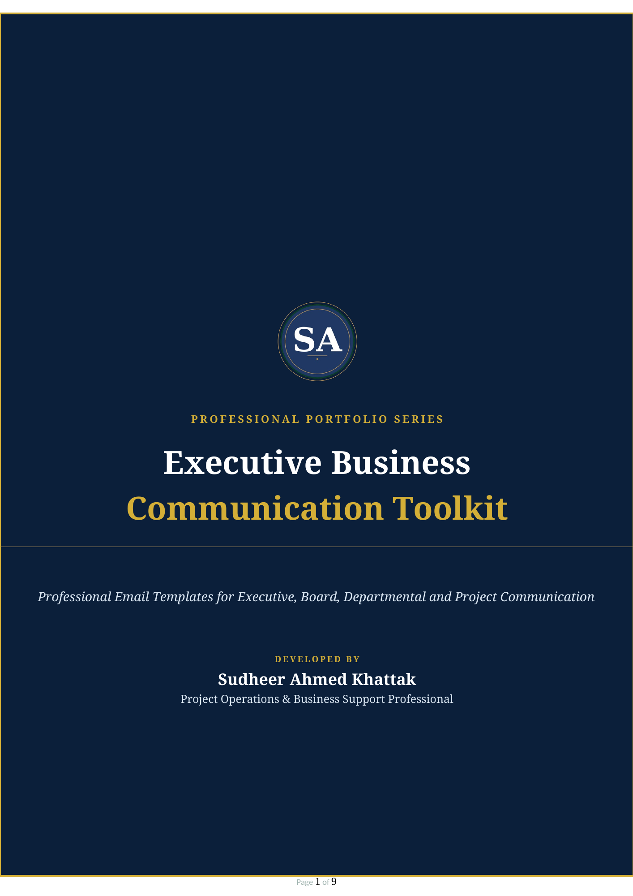

# Executive Business Communication Toolkit

  

  <strong>Developed by: Sudheer Ahmed Khattak</strong> 
  Project Operations & Business Support Professional

---

## Executive Summary

The **Executive Business Communication Toolkit** is a professional collection of executive-level business email templates developed for project management, executive offices, PMO teams, and corporate administration. It provides ready-to-use communication formats for daily business operations while maintaining professional standards and corporate communication practices.

The toolkit is designed to improve communication efficiency, ensure consistency across business correspondence, and support executive offices with structured, polished, and decision-focused email templates.

---

## Business Objective

This toolkit was developed to help professionals:

- Standardize executive communication
- Improve email quality and professionalism
- Save drafting time
- Support executive offices
- Enhance corporate correspondence
- Maintain communication consistency
- Improve stakeholder engagement
- Support daily business operations

---

## Toolkit Highlights

This toolkit includes:

- Executive Email Templates
- Management Communication Samples
- Employee Notification Emails
- Meeting Invitations
- Approval Request Emails
- Project Coordination Emails
- HR Communication Templates
- Professional Follow-up Emails
- Vendor & Client Communication
- Corporate Business Correspondence

---

## Included Documents

The toolkit contains professionally designed sample emails covering:

- Executive Office Communication
- CEO Office Correspondence
- Project Administration
- PMO Communication
- HR Coordination
- Operational Notifications
- Internal Business Communication
- Corporate Reporting

---

## Tools & Technologies

- Microsoft Word
- Microsoft Office
- Corporate Documentation
- Executive Communication
- Business Writing
- Project Administration
- Professional Documentation
- Corporate Reporting
- Office Management

---

## Skills Demonstrated

- Business Communication
- Executive Correspondence
- Professional Writing
- Corporate Documentation
- Office Administration
- Project Coordination
- Executive Support
- PMO Support
- Management Reporting
- Business Operations

---

> **⚠️ Portfolio Demonstration Notice**
>
> All documents, templates, reports, and communication samples in this repository are created solely for portfolio demonstration purposes using independently developed sample content. They do not contain confidential company information or actual corporate correspondence.

---

## Author

**Sudheer Ahmed Khattak**

Project Operations & Business Support Professional

- 🌐 [Professional Portfolio](https://sites.google.com/view/sudheer-ahmed)
- 💼 [LinkedIn Profile](https://www.linkedin.com/in/sudheer-ahmed-khattak)
- 📧 [Email](mailto:khattaksudheer@gmail.com)

---

## Project Downloads

Use the direct-download links below. Files that cannot be previewed by GitHub will automatically download directly to your device.

| Project File | Description | Access |
|---|---|---|
| 📝 Word Document | Complete Executive Business Communication Toolkit in `.docx` format | [⬇️ Download Word Document](https://github.com/sudheer-ahmed-khattak/Excel-Trackers-and-Management-Reports/raw/main/Executive_Business_Communication_Toolkit/Executive_Business_Communication_Toolkit.docx) |
| 📄 PDF Version | Printable PDF version of the toolkit | [⬇️ Download PDF](https://github.com/sudheer-ahmed-khattak/Excel-Trackers-and-Management-Reports/raw/main/Executive_Business_Communication_Toolkit/Executive_Business_Communication_Toolkit.pdf) |
| 🖥️ Preview Image | High-resolution toolkit preview | [👁️ View Preview](https://raw.githubusercontent.com/sudheer-ahmed-khattak/Excel-Trackers-and-Management-Reports/main/Executive_Business_Communication_Toolkit/Executive_Business_Communication_Toolkit_Preview.png) |

---

📝 **[DOWNLOAD WORD DOCUMENT](https://github.com/sudheer-ahmed-khattak/Excel-Trackers-and-Management-Reports/raw/main/Executive_Business_Communication_Toolkit/Executive_Business_Communication_Toolkit.docx)** &nbsp; | &nbsp;
📄 **[DOWNLOAD PDF](https://github.com/sudheer-ahmed-khattak/Excel-Trackers-and-Management-Reports/raw/main/Executive_Business_Communication_Toolkit/Executive_Business_Communication_Toolkit.pdf)** &nbsp; | &nbsp;
🖥️ **[VIEW PREVIEW](https://raw.githubusercontent.com/sudheer-ahmed-khattak/Excel-Trackers-and-Management-Reports/main/Executive_Business_Communication_Toolkit/Executive_Business_Communication_Toolkit_Preview.png)**

---

<a href="https://github.com/sudheer-ahmed-khattak">
<strong>⬅️ BACK TO GITHUB PORTFOLIO</strong>
</a>

