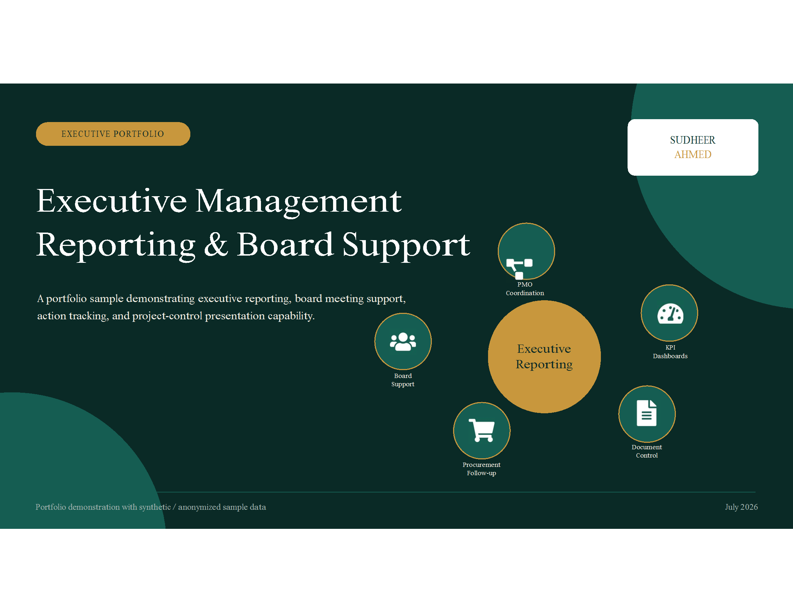

# Executive Management Presentation

  

  <strong>Developed by: Sudheer Ahmed Khattak</strong> 
  Project Operations & Business Support Professional

---

## Executive Summary

The **Executive Management Presentation** is a professional executive reporting presentation developed to communicate strategic business information, management KPIs, operational updates, board-level reporting, and executive decision support in a clear and visually engaging format.

This presentation demonstrates how complex operational information can be transformed into concise executive reports that support leadership meetings, board discussions, stakeholder communication, and strategic planning.

---

## Business Objective

This presentation was developed to help management:

- Present executive KPIs
- Support board meetings
- Communicate strategic updates
- Visualize operational performance
- Improve management reporting
- Present project achievements
- Support executive decision-making
- Deliver professional leadership presentations

---

## Presentation Highlights

This presentation includes:

- Executive Dashboard Overview
- Board Reporting Slides
- KPI Presentation
- Operational Performance Summary
- Strategic Business Updates
- Executive Reporting Layouts
- Leadership Presentation Design
- Professional Data Visualization
- Project Status Reporting
- Decision Support Presentation

---

## Key Performance Areas

The presentation demonstrates:

- Executive Reporting
- Management KPIs
- Business Performance
- Operational Highlights
- Strategic Updates
- Project Reporting
- Board Communication
- Executive Decision Support
- Professional Storytelling
- Leadership Reporting

---

## Tools & Technologies

- Microsoft PowerPoint
- Executive Presentation Design
- Business Storytelling
- KPI Reporting
- Management Reporting
- Executive Communication
- Business Intelligence
- Data Visualization
- Leadership Reporting

---

## Project Deliverables

This project package includes:

- Executive PowerPoint Presentation
- PDF Presentation
- Presentation Preview

---

## Skills Demonstrated

- Executive Reporting
- Board Secretariat Support
- Executive Presentation Design
- Management Reporting
- Business Communication
- KPI Reporting
- Data Visualization
- Leadership Communication
- Strategic Reporting
- Professional Presentation Design

---

## Data & Confidentiality Notice

> **Disclaimer**
>
> This project has been created exclusively for portfolio and demonstration purposes.
>
> All presentation content, values, business information, company references, project details, executive reports, and management information presented in this portfolio are independently created sample data.
>
> No confidential company information, proprietary data, internal presentations, board documents, employee records, company logos, or client information have been used.

---

## Author

**Sudheer Ahmed Khattak**

Project Operations & Business Support Professional

- 🌐 [Professional Portfolio](https://sites.google.com/view/sudheer-ahmed)
- 💼 [LinkedIn Profile](https://www.linkedin.com/in/sudheer-ahmed-khattak)
- 📧 [Email](mailto:khattaksudheer@gmail.com)

---

## Project Downloads

Use the direct-download links below. Files that cannot be previewed by GitHub will automatically download.

| Project File | Description | Access |
|---|---|---|
| 📑 Executive Presentation | Professional PowerPoint Presentation | [⬇️ Download Presentation](https://raw.githubusercontent.com/sudheer-ahmed-khattak/Excel-Trackers-and-Management-Reports/main/Executive_Management_Presentation/Executive_Management_Reporting_Board_Support_Portfolio.pptx) |
| 📄 PDF Version | Printable presentation | [⬇️ Download PDF](https://raw.githubusercontent.com/sudheer-ahmed-khattak/Excel-Trackers-and-Management-Reports/main/Executive_Management_Presentation/Executive_Management_Reporting_Board_Support.pdf) |
| 🖼️ Presentation Preview | High-resolution presentation preview | [👁️ View Preview](https://raw.githubusercontent.com/sudheer-ahmed-khattak/Excel-Trackers-and-Management-Reports/main/Executive_Management_Presentation/Executive_Management_Board_Support_Preview.png) |

---

📊 **[DOWNLOAD POWER BI DASHBOARD](Power_BI_Dashboard.pbix)** &nbsp; | &nbsp;
📄 **[DOWNLOAD PDF REPORT](Project_Report.pdf)** &nbsp; | &nbsp;
📁 **[DOWNLOAD EXCEL DATASET](Sample_Dataset.xlsx)** &nbsp; | &nbsp;
📽️ **[DOWNLOAD POWERPOINT PRESENTATION](Project_Presentation.pptx)**

---

<a href="https://github.com/sudheer-ahmed-khattak">
<strong>⬅ BACK TO GITHUB PORTFOLIO</strong>
</a>

