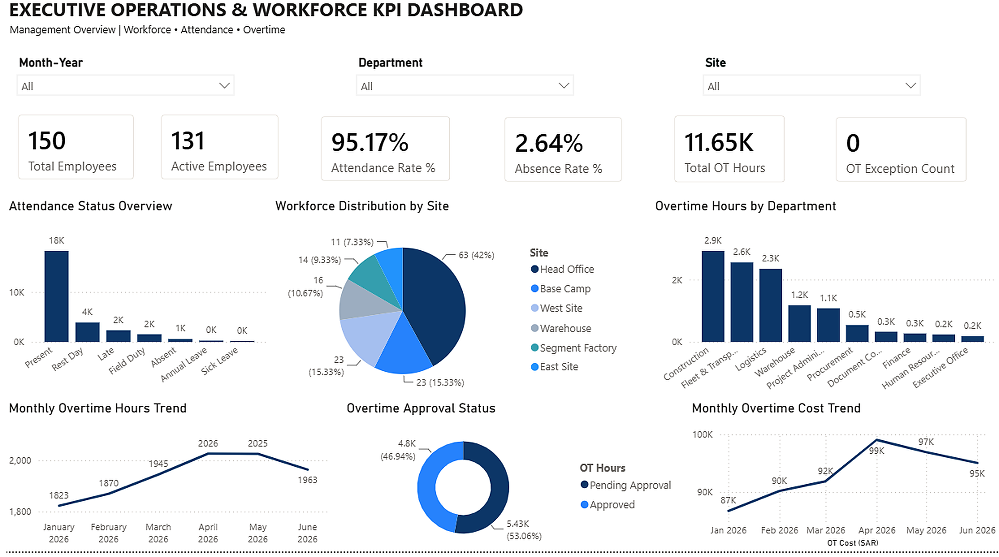

# Executive Operations Workforce KPI Dashboard

  

  <strong>Developed by: Sudheer Ahmed Khattak</strong> 
  Project Operations & Business Support Professional

---

## Executive Summary

The **Executive Operations Workforce KPI Dashboard** is a business intelligence reporting solution designed to provide executive management with a centralized view of workforce performance, attendance, overtime, and operational KPIs.

The dashboard transforms structured sample data into clear and meaningful business insights, supporting workforce planning, operational monitoring, management reporting, and informed decision-making.

---

> **⚠️ Portfolio Demonstration Notice**
>
> All dashboards, reports, documents, and datasets in this repository are created solely for portfolio demonstration purposes using independently developed sample or anonymized data. No official company data or confidential information is included.

---

## Business Objective

This dashboard was developed to help management:

- Monitor overall workforce performance
- Analyze attendance and absence trends
- Track overtime utilization and approval status
- Compare departmental performance
- Review workforce distribution by operational site
- Monitor overtime cost trends
- Identify overtime exceptions
- Improve executive reporting and operational visibility

---

## Dashboard Highlights

The dashboard includes:

- Executive Workforce Overview
- Attendance Status Analysis
- Active Employee Tracking
- Workforce Distribution by Site
- Department-wise Overtime Analysis
- Monthly Overtime Hours Trend
- Overtime Approval Status
- Monthly Overtime Cost Trend
- Interactive Month, Department, and Site Filters
- Executive KPI Summary Cards

---

## Key Performance Indicators

The dashboard reports:

- Total Employees
- Active Employees
- Attendance Rate
- Absence Rate
- Total Overtime Hours
- Overtime Exception Count
- Department-wise Overtime
- Site-wise Workforce Distribution
- Monthly Overtime Trend
- Approved and Pending Overtime
- Monthly Overtime Cost

---

## Tools & Technologies

- Microsoft Power BI
- Microsoft Excel
- Power Query
- DAX
- Data Modeling
- KPI Reporting
- Executive Reporting
- Workforce Analytics
- Data Visualization

---

## Project Deliverables

This project package includes:

- Interactive Power BI Dashboard
- Executive PDF Dashboard Report
- Sample Excel Dataset
- Dashboard Preview
- Project Documentation

---

## Skills Demonstrated

- Executive Reporting
- KPI Reporting
- Dashboard Design
- Workforce Analytics
- Business Intelligence
- Operational Reporting
- Performance Analysis
- Data Visualization
- Management Reporting
- Data Organization and Presentation

---

## Data & Confidentiality Notice

> **Disclaimer**
>
> This project was created exclusively for portfolio and demonstration purposes.
>
> All datasets, values, employee information, company references, and business records displayed in this project are independently created sample data.
>
> No confidential company information, proprietary data, internal documents, employee records, company logos, or client information has been used.

---

## Author

**Sudheer Ahmed Khattak**  
Project Operations & Business Support Professional

- 🌐 [Professional Portfolio](https://sites.google.com/view/sudheer-ahmed)
- 💼 [LinkedIn Profile](https://www.linkedin.com/in/sudheer-ahmed-khattak)
- 📧 [Email](mailto:khattaksudheer@gmail.com)

---

## Project Downloads

Use the direct-download links below. Files that cannot be previewed by GitHub, such as Power BI files, will download directly to your device.

| Project File | Description | Access |
|---|---|---|
| 📊 Power BI Dashboard | Complete interactive Power BI dashboard in `.pbix` format | [⬇️ Download Power BI Dashboard](https://raw.githubusercontent.com/sudheer-ahmed-khattak/Excel-Trackers-and-Management-Reports/main/Executive_Operations_Workforce_KPI_Dashboard/Executive_Operations_Workforce_KPI_Dashboard.pbix) |
| 📄 Executive PDF Report | PDF version of the dashboard for quick review | [⬇️ Download PDF Report](https://raw.githubusercontent.com/sudheer-ahmed-khattak/Excel-Trackers-and-Management-Reports/main/Executive_Operations_Workforce_KPI_Dashboard/Executive_Operations_Workforce_KPI_Dashboard_Report.pdf) |
| 📈 Sample Excel Dataset | Structured sample dataset used for the dashboard | [⬇️ Download Excel Dataset](https://raw.githubusercontent.com/sudheer-ahmed-khattak/Excel-Trackers-and-Management-Reports/main/Executive_Operations_Workforce_KPI_Dashboard/Executive_Operations_Workforce_KPI_Dataset.xlsx) |

 

  <a href="https://raw.githubusercontent.com/sudheer-ahmed-khattak/Excel-Trackers-and-Management-Reports/main/Executive_Operations_Workforce_KPI_Dashboard/Executive_Operations_Workforce_KPI_Dashboard.pbix">
    <strong>📊 DOWNLOAD POWER BI DASHBOARD</strong>
  </a>
  &nbsp;&nbsp;|&nbsp;&nbsp;
  <a href="https://raw.githubusercontent.com/sudheer-ahmed-khattak/Excel-Trackers-and-Management-Reports/main/Executive_Operations_Workforce_KPI_Dashboard/Executive_Operations_Workforce_KPI_Dashboard_Report.pdf">
    <strong>📄 DOWNLOAD PDF REPORT</strong>
  </a>
  &nbsp;&nbsp;|&nbsp;&nbsp;
  <a href="https://raw.githubusercontent.com/sudheer-ahmed-khattak/Excel-Trackers-and-Management-Reports/main/Executive_Operations_Workforce_KPI_Dashboard/Executive_Operations_Workforce_KPI_Dataset.xlsx">
    <strong>📈 DOWNLOAD EXCEL DATASET</strong>
  </a>

---

  <a href="https://github.com/sudheer-ahmed-khattak">
    <strong>⬅ BACK TO GITHUB PORTFOLIO</strong>
  </a>

