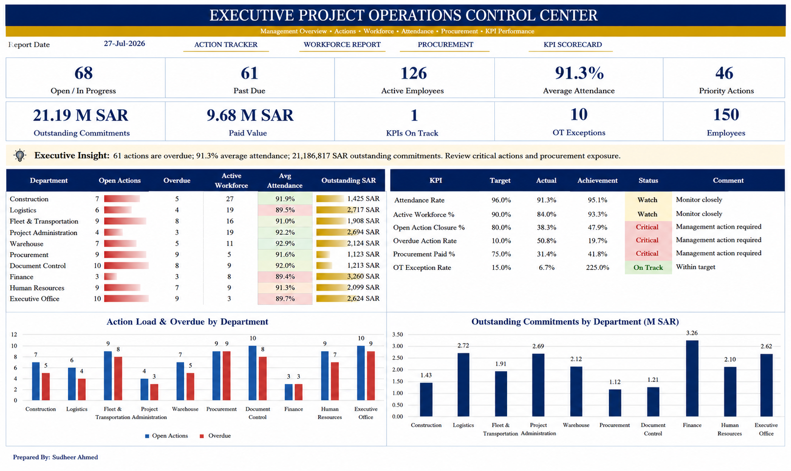

# Executive Project Operations Control Center

  

  <strong>Developed by: Sudheer Ahmed Khattak</strong> 
  Project Operations & Business Support Professional

---

## Executive Summary

The **Executive Project Operations Control Center** is an executive reporting solution developed to provide senior management with a centralized view of project performance, operational activities, workforce status, procurement progress, and management KPIs.

The dashboard consolidates multiple operational data sources into a single management view, enabling faster decision-making, project monitoring, and executive reporting.

---

## Business Objective

This dashboard was developed to help management:

- Monitor overall project performance
- Track operational progress
- Review workforce statistics
- Monitor procurement activities
- Analyze project KPIs
- Support executive decision-making
- Improve operational visibility
- Enhance project governance

---

## Dashboard Highlights

The dashboard includes:

- Executive Project Overview
- Operational KPI Dashboard
- Workforce Summary
- Procurement Monitoring
- Project Progress Indicators
- Priority Action Monitoring
- Executive Scorecards
- Interactive Filters
- Management KPI Cards
- Operational Performance Summary

---

## Key Performance Indicators

The dashboard reports:

- Active Employees
- Workforce Distribution
- Open Actions
- Procurement Status
- Project Progress
- Operational Performance
- Attendance Summary
- Department Performance
- Executive KPI Scorecards
- Priority Monitoring

---

## Tools & Technologies

- Microsoft Excel
- Microsoft Power BI
- Power Query
- Data Modeling
- KPI Reporting
- Executive Reporting
- Dashboard Design
- Business Intelligence
- Data Visualization

---

## Project Deliverables

This project package includes:

- Interactive Dashboard
- Executive PDF Report
- Sample Excel Dataset
- Dashboard Preview
- Project Documentation

---

## Skills Demonstrated

- Executive Reporting
- Project Administration
- PMO Support
- KPI Reporting
- Dashboard Design
- Business Intelligence
- Operational Reporting
- Project Monitoring
- Data Visualization
- Executive Decision Support

---

## Data & Confidentiality Notice

> **Disclaimer**
>
> This project has been created exclusively for portfolio and demonstration purposes.
>
> All datasets, values, employee information, company names, project details, and business records presented in this dashboard are independently created sample data.
>
> No confidential company information, proprietary data, internal documents, employee records, client information, or company logos have been used.

---

## Author

**Sudheer Ahmed Khattak**  
Project Operations & Business Support Professional

- 🌐 **Portfolio:** https://sites.google.com/view/sudheer-ahmed
- 💼 **LinkedIn:** https://www.linkedin.com/in/sudheer-ahmed-khattak
- 📧 **Email:** khattaksudheer@gmail.com

---

## Project Downloads

Use the direct-download links below. Files that cannot be previewed by GitHub will automatically download.

| Project File | Description | Access |
|---|---|---|
| 📊 Interactive Dashboard | Executive Project Operations Dashboard | [⬇️ Download Dashboard](https://raw.githubusercontent.com/sudheer-ahmed-khattak/Excel-Trackers-and-Management-Reports/main/Executive_Project_Operations_Control_Center/Executive_Project_Operations_Control_Center.xlsx) |
| 📄 Executive PDF Report | Printable management report | [⬇️ Download PDF Report](https://raw.githubusercontent.com/sudheer-ahmed-khattak/Excel-Trackers-and-Management-Reports/main/Executive_Project_Operations_Control_Center/Executive_Project_Operations_Control_Center_Report.pdf) |
| 📈 Sample Dataset | Sample operational dataset | [⬇️ Download Dataset](https://raw.githubusercontent.com/sudheer-ahmed-khattak/Excel-Trackers-and-Management-Reports/main/Executive_Project_Operations_Control_Center/Executive_Project_Operations_Control_Center_Dataset.xlsx) |

 

<a href="https://raw.githubusercontent.com/sudheer-ahmed-khattak/Excel-Trackers-and-Management-Reports/main/Executive_Project_Operations_Control_Center/Executive_Project_Operations_Control_Center.xlsx"><strong>📊 DOWNLOAD DASHBOARD</strong></a>

&nbsp;&nbsp;|&nbsp;&nbsp;

<a href="https://raw.githubusercontent.com/sudheer-ahmed-khattak/Excel-Trackers-and-Management-Reports/main/Executive_Project_Operations_Control_Center/Executive_Project_Operations_Control_Center_Report.pdf"><strong>📄 DOWNLOAD PDF REPORT</strong></a>

&nbsp;&nbsp;|&nbsp;&nbsp;

<a href="https://raw.githubusercontent.com/sudheer-ahmed-khattak/Excel-Trackers-and-Management-Reports/main/Executive_Project_Operations_Control_Center/Executive_Project_Operations_Control_Center_Dataset.xlsx"><strong>📈 DOWNLOAD DATASET</strong></a>

---

<a href="https://github.com/sudheer-ahmed-khattak">
<strong>⬅ BACK TO GITHUB PORTFOLIO</strong>
</a>

