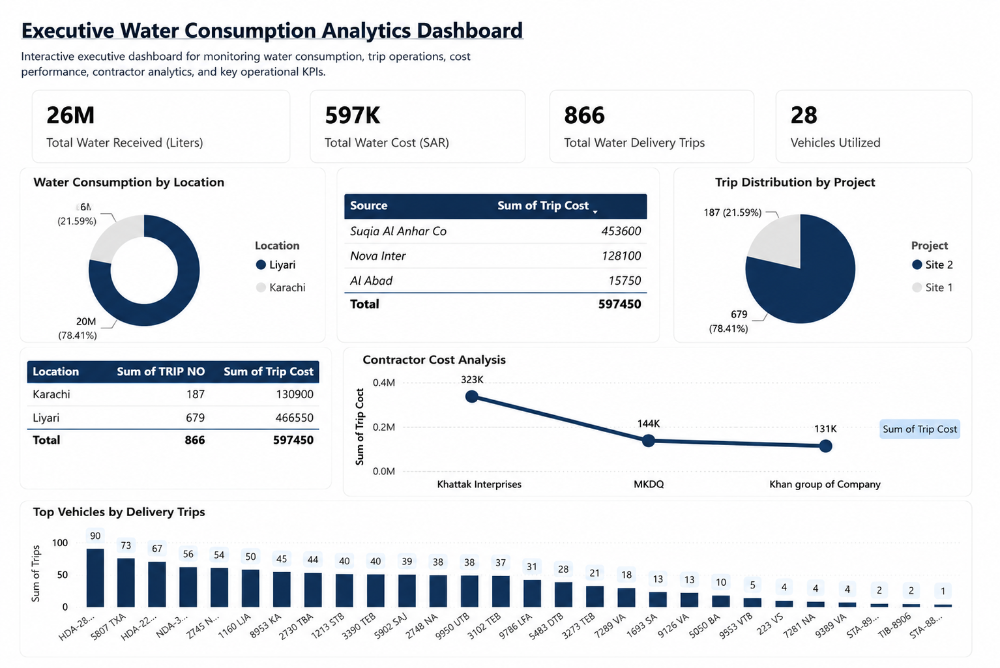

# Executive Water Consumption Analytics Dashboard

  

  <strong>Developed by: Sudheer Ahmed Khattak</strong> 
  Project Operations & Business Support Professional

---

## Executive Summary

The **Executive Water Consumption Analytics Dashboard** is an interactive Power BI solution developed to provide executive visibility into water consumption, delivery operations, transportation costs, contractor performance, supplier analysis, fleet utilization, and project-wise operational KPIs.

The dashboard consolidates operational data into a centralized management view, enabling leadership teams to monitor resource utilization, optimize transportation efficiency, evaluate contractor performance, and support data-driven operational decisions.

---

## Business Objective

This dashboard was developed to help management:

- Monitor water consumption
- Track delivery operations
- Analyze transportation costs
- Evaluate contractor performance
- Monitor supplier performance
- Review project-wise trip distribution
- Optimize fleet utilization
- Improve operational visibility
- Support executive decision-making

---

## Dashboard Highlights

This dashboard includes:

- Executive KPI Overview
- Water Consumption Analysis
- Location Performance Analysis
- Project Distribution Analysis
- Contractor Cost Analysis
- Supplier Cost Summary
- Fleet Utilization Analysis
- Top Vehicle Performance
- Interactive Power BI Dashboard
- Executive KPI Cards

---

## Key Performance Indicators (KPIs)

The dashboard reports:

- Total Water Received (Liters)
- Total Water Cost (SAR)
- Total Water Delivery Trips
- Vehicles Utilized
- Water Consumption by Location
- Trip Distribution by Project
- Contractor Cost Analysis
- Supplier Cost Summary
- Location Performance Summary
- Top Vehicles by Delivery Trips

---

## Tools & Technologies

- Microsoft Power BI
- Power Query
- DAX
- Data Modeling
- Business Intelligence
- Executive Dashboard Design
- KPI Reporting
- Operational Analytics
- Data Visualization

---

## Project Deliverables

This project package includes:

- Interactive Power BI Dashboard (.pbix)
- Dashboard Preview (.png)
- Executive PDF Report

---

## Skills Demonstrated

- Power BI Dashboard Development
- Business Intelligence
- Executive Reporting
- KPI Reporting
- Operational Analytics
- Fleet Analytics
- Cost Analysis
- Data Visualization
- Performance Reporting
- Management Reporting

---

> **⚠️ Portfolio Demonstration Notice**
>
> All dashboards, reports, documents, and datasets in this repository are created solely for portfolio demonstration purposes using independently developed sample or anonymized data. No official company data or confidential information is included.

---

## Author

**Sudheer Ahmed Khattak**

Project Operations & Business Support Professional

- 🌐 Professional Portfolio: https://sites.google.com/view/sudheer-ahmed
- 💼 LinkedIn: https://www.linkedin.com/in/sudheer-ahmed-khattak
- 📧 Email: khattaksudheer@gmail.com

---

## Project Downloads

| Project File | Description | Access |
|---|---|---|
| 📊 Power BI Dashboard | Interactive Power BI dashboard (.pbix) | [⬇️ Download Power BI Dashboard](https://github.com/sudheer-ahmed-khattak/Excel-Trackers-and-Management-Reports/raw/main/Executive_Water_Consumption_Analytics_Dashboard/Executive_Water_Consumption_Analytics_Dashboard.pbix) |
| 📄 Executive PDF Report | PDF version of the dashboard | [⬇️ Download PDF Report](https://github.com/sudheer-ahmed-khattak/Excel-Trackers-and-Management-Reports/raw/main/Executive_Water_Consumption_Analytics_Dashboard/Executive_Water_Consumption_Analytics_Dashboard_Report.pdf) |
| 🖥️ Dashboard Preview | High-resolution dashboard preview | [👁️ View Dashboard](https://raw.githubusercontent.com/sudheer-ahmed-khattak/Excel-Trackers-and-Management-Reports/main/Executive_Water_Consumption_Analytics_Dashboard/Executive_Water_Consumption_Analytics_Dashboard_Preview.png) |

---

📊 **[DOWNLOAD POWER BI DASHBOARD](https://github.com/sudheer-ahmed-khattak/Excel-Trackers-and-Management-Reports/raw/main/Executive_Water_Consumption_Analytics_Dashboard/Executive_Water_Consumption_Analytics_Dashboard.pbix)** &nbsp; | &nbsp;
📄 **[DOWNLOAD PDF REPORT](https://github.com/sudheer-ahmed-khattak/Excel-Trackers-and-Management-Reports/raw/main/Executive_Water_Consumption_Analytics_Dashboard/Executive_Water_Consumption_Analytics_Dashboard_Report.pdf)** &nbsp; | &nbsp;
🖥️ **[VIEW DASHBOARD](https://raw.githubusercontent.com/sudheer-ahmed-khattak/Excel-Trackers-and-Management-Reports/main/Executive_Water_Consumption_Analytics_Dashboard/Executive_Water_Consumption_Analytics_Dashboard_Preview.png)**

---

<a href="https://github.com/sudheer-ahmed-khattak">
<strong>⬅ BACK TO GITHUB PORTFOLIO</strong>
</a>

