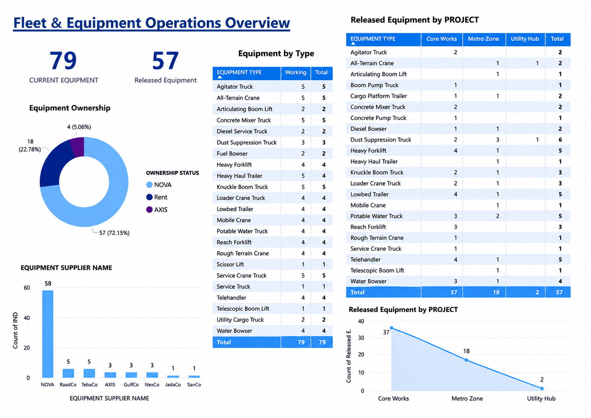

# Fleet Equipment Operations Dashboard

  

---

## Executive Summary

A professional fleet operations dashboard developed to monitor equipment utilization, fleet availability, maintenance performance, operational efficiency, and executive KPIs through interactive reporting.

> Designed to help management make faster operational decisions by providing a complete overview of fleet performance and equipment status.

---

## Key Features

- Fleet Operations Dashboard
- Equipment Utilization
- Maintenance Monitoring
- Fleet Availability Tracking
- Operational KPI Reporting
- Executive Reporting
- Interactive Visual Analytics

---

## Dashboard Preview

The dashboard provides management with a centralized view of fleet performance, equipment utilization, maintenance activities, and operational KPIs to support informed decision-making.

---

## Files Included

- 📊 Dashboard File
- 🖼 Dashboard Preview
- 📄 Documentation

---

## Skills Demonstrated

- Microsoft Excel
- Dashboard Design
- KPI Reporting
- Fleet Analytics
- Executive Reporting
- Data Visualization
- Business Analysis

---

### ← Back to Portfolio

**https://github.com/sudheer-ahmed-khattak/Excel-Trackers-and-Management-Reports**

