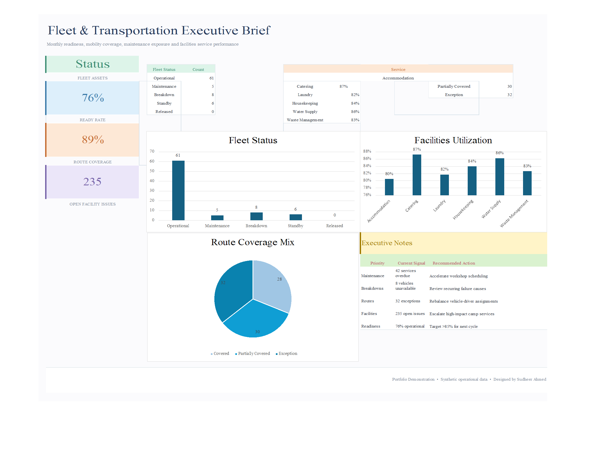

# Fleet Transportation Executive Brief

  

  <strong>Developed by: Sudheer Ahmed Khattak</strong> 
  Project Operations & Business Support Professional

---

## Executive Summary

The **Fleet Transportation Executive Brief** is an executive reporting dashboard developed to provide project leadership with a centralized overview of transportation operations, vehicle movement, fleet utilization, trip performance, operational readiness, and transportation KPIs.

The dashboard transforms transportation data into meaningful business insights, enabling management to monitor fleet activities, optimize transportation resources, improve operational efficiency, and support informed executive decision-making.

---

## Business Objective

This dashboard was developed to help management:

- Monitor transportation operations
- Track vehicle utilization
- Review trip performance
- Analyze fleet movement
- Monitor transportation resources
- Improve operational efficiency
- Support transportation planning
- Enhance executive reporting

---

## Dashboard Highlights

This dashboard includes:

- Fleet Transportation Overview
- Vehicle Utilization Analysis
- Fleet Movement Monitoring
- Transportation Performance Summary
- Vehicle Status Analysis
- Route Performance Monitoring
- Executive KPI Cards
- Transportation Performance Indicators
- Operational Dashboard
- Executive Decision Support

---

## Key Performance Indicators (KPIs)

The dashboard reports:

- Active Vehicles
- Vehicle Utilization
- Fleet Availability
- Transportation Performance
- Trip Performance
- Route Analysis
- Vehicle Allocation
- Fleet Movement Summary
- Operational Performance
- Executive Transportation KPIs

---

## Tools & Technologies

- Microsoft Excel
- Executive Dashboard Design
- Advanced Excel
- KPI Reporting
- Fleet Reporting
- Transportation Analytics
- Executive Reporting
- Business Intelligence
- Data Visualization

---

## Project Deliverables

This project package includes:

- Interactive Executive Dashboard
- Executive PDF Report
- Dashboard Preview
- Project Documentation

---

## Skills Demonstrated

- Fleet Reporting
- Transportation Analytics
- Executive Reporting
- Dashboard Design
- KPI Reporting
- Operational Reporting
- Business Intelligence
- Data Visualization
- Resource Planning
- Management Reporting

---

## Data & Confidentiality Notice

> **Disclaimer**
>
> This project has been created exclusively for portfolio and demonstration purposes.
>
> All datasets, values, transportation records, fleet information, company references, project details, and business records presented in this dashboard are independently created sample data.
>
> No confidential company information, proprietary data, internal documents, employee records, transportation logs, company logos, or client information have been used.

---

## Author

**Sudheer Ahmed Khattak**

Project Operations & Business Support Professional

- 🌐 [Professional Portfolio](https://sites.google.com/view/sudheer-ahmed)
- 💼 [LinkedIn Profile](https://www.linkedin.com/in/sudheer-ahmed-khattak)
- 📧 [Email](mailto:khattaksudheer@gmail.com)

---

## Project Downloads

Use the direct-download links below. Files that cannot be previewed by GitHub will automatically download.

| Project File | Description | Access |
|---|---|---|
| 📊 Executive Dashboard | Interactive Fleet Transportation Dashboard | [⬇️ Download Dashboard](https://raw.githubusercontent.com/sudheer-ahmed-khattak/Excel-Trackers-and-Management-Reports/main/Fleet_Transportation_Executive_Brief/Fleet_Transportation_Executive_Brief.xlsx) |
| 📄 Executive PDF Report | Printable dashboard report | [⬇️ Download PDF Report](https://raw.githubusercontent.com/sudheer-ahmed-khattak/Excel-Trackers-and-Management-Reports/main/Fleet_Transportation_Executive_Brief/Fleet_Transportation_Executive_Brief.pdf) |
| 🖼️ Dashboard Preview | High-resolution dashboard preview | [👁️ View Preview](https://raw.githubusercontent.com/sudheer-ahmed-khattak/Excel-Trackers-and-Management-Reports/main/Fleet_Transportation_Executive_Brief/Fleet_Transportation_Executive_Brief.png) |

---

<a href="https://github.com/sudheer-ahmed-khattak">
<strong>⬅ BACK TO GITHUB PORTFOLIO</strong>
</a>

