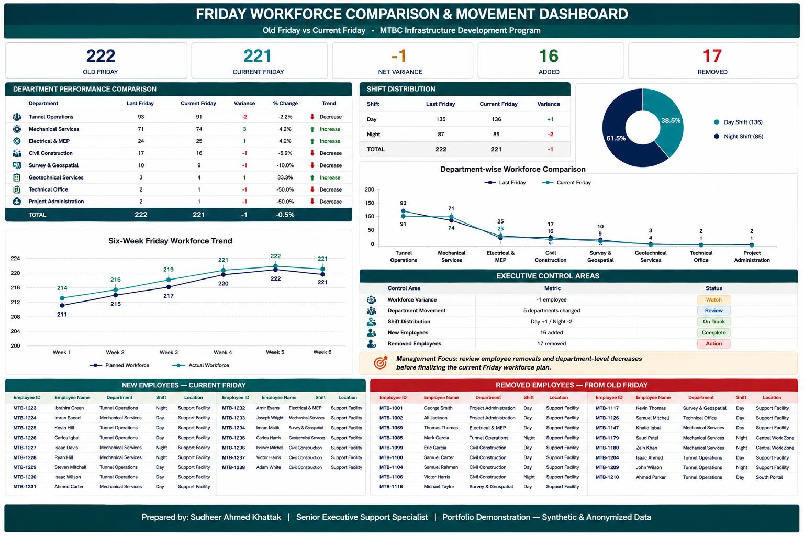

# Friday Workforce Comparison Dashboard

  

  <strong>Developed by: Sudheer Ahmed Khattak</strong> 
  Project Operations & Business Support Professional

---

## Executive Summary

The **Friday Workforce Comparison Dashboard** is an executive workforce reporting solution designed to compare manpower deployment across two consecutive Friday work schedules. It provides project leadership with a centralized view of workforce movement, attendance changes, departmental performance, manpower additions, reductions, and operational workforce trends.

The dashboard converts workforce comparison data into meaningful management insights, enabling executives to identify workforce fluctuations, monitor departmental performance, optimize manpower planning, and support data-driven operational decision-making.

---

## Business Objective

This dashboard was developed to help management:

- Compare consecutive Friday workforce reports
- Monitor manpower additions and reductions
- Analyze departmental workforce changes
- Track workforce movement by location
- Identify attendance variations
- Monitor workforce deployment trends
- Support manpower planning
- Improve executive reporting and decision-making

---

## Dashboard Highlights

This dashboard includes:

- Friday Workforce Comparison Overview
- Current vs Previous Friday Analysis
- Workforce Change Summary
- Department Performance Comparison
- Added & Removed Employee Analysis
- Location-wise Workforce Distribution
- Workforce Movement Dashboard
- Executive KPI Cards
- Workforce Trend Analysis
- Interactive Executive Dashboard

---

## Key Performance Indicators (KPIs)

The dashboard reports:

- Current Friday Workforce
- Previous Friday Workforce
- Added Employees
- Removed Employees
- Workforce Variance
- Department Performance
- Location Comparison
- Attendance Changes
- Workforce Movement
- Executive Workforce KPIs

---

## Tools & Technologies

- Microsoft Excel
- Executive Dashboard Design
- Advanced Excel
- KPI Reporting
- Workforce Analytics
- Management Reporting
- Business Intelligence
- Executive Reporting
- Data Visualization

---

## Project Deliverables

This project package includes:

- Interactive Workforce Comparison Dashboard
- Executive PDF Report
- Dashboard Preview
- Project Documentation

---

## Skills Demonstrated

- Workforce Analytics
- Executive Reporting
- Dashboard Design
- KPI Reporting
- Department Performance Analysis
- Workforce Planning
- Management Reporting
- Business Intelligence
- Data Visualization
- Operational Reporting

---

> **⚠️ Portfolio Demonstration Notice**
>
> All dashboards, reports, documents, and datasets in this repository are created solely for portfolio demonstration purposes using independently developed sample or anonymized data. No official company data or confidential information is included.

---

## Author

**Sudheer Ahmed Khattak**

Project Operations & Business Support Professional

- 🌐 [Professional Portfolio](https://sites.google.com/view/sudheer-ahmed)
- 💼 [LinkedIn Profile](https://www.linkedin.com/in/sudheer-ahmed-khattak)
- 📧 [Email](mailto:khattaksudheer@gmail.com)

---

## Project Downloads

Use the direct-download links below. Files that cannot be previewed by GitHub will automatically download directly to your device.

| Project File | Description | Access |
|---|---|---|
| 📊 Excel Dashboard | Complete interactive Friday Workforce Comparison Dashboard in `.xlsx` format | [⬇️ Download Excel Dashboard](https://github.com/sudheer-ahmed-khattak/Excel-Trackers-and-Management-Reports/raw/main/Friday_Workforce_Comparison_Dashboard/Friday_Workforce_Comparison_Dashboard.xlsx) |
| 📄 Executive PDF Report | PDF version of the dashboard for quick review | [⬇️ Download PDF Report](https://github.com/sudheer-ahmed-khattak/Excel-Trackers-and-Management-Reports/raw/main/Friday_Workforce_Comparison_Dashboard/Friday_Workforce_Comparison_Dashboard.pdf) |
| 🖥️ Dashboard Preview | High-resolution preview of the dashboard | [👁️ View Dashboard](https://raw.githubusercontent.com/sudheer-ahmed-khattak/Excel-Trackers-and-Management-Reports/main/Friday_Workforce_Comparison_Dashboard/Friday_Workforce_Comparison_Dashboard_Preview.png) |

---

&nbsp;&nbsp;&nbsp;&nbsp;&nbsp;&nbsp;&nbsp;&nbsp;
📊 **[DOWNLOAD EXCEL DASHBOARD](https://github.com/sudheer-ahmed-khattak/Excel-Trackers-and-Management-Reports/raw/main/Friday_Workforce_Comparison_Dashboard/Friday_Workforce_Comparison_Dashboard.xlsx)** &nbsp; | &nbsp;
📄 **[DOWNLOAD PDF REPORT](https://github.com/sudheer-ahmed-khattak/Excel-Trackers-and-Management-Reports/raw/main/Friday_Workforce_Comparison_Dashboard/Friday_Workforce_Comparison_Dashboard.pdf)** &nbsp; | &nbsp;
🖥️ **[VIEW DASHBOARD](https://raw.githubusercontent.com/sudheer-ahmed-khattak/Excel-Trackers-and-Management-Reports/main/Friday_Workforce_Comparison_Dashboard/Friday_Workforce_Comparison_Dashboard_Preview.png)**

---

<a href="https://github.com/sudheer-ahmed-khattak">
<strong>⬅️ BACK TO GITHUB PORTFOLIO</strong>
</a>

