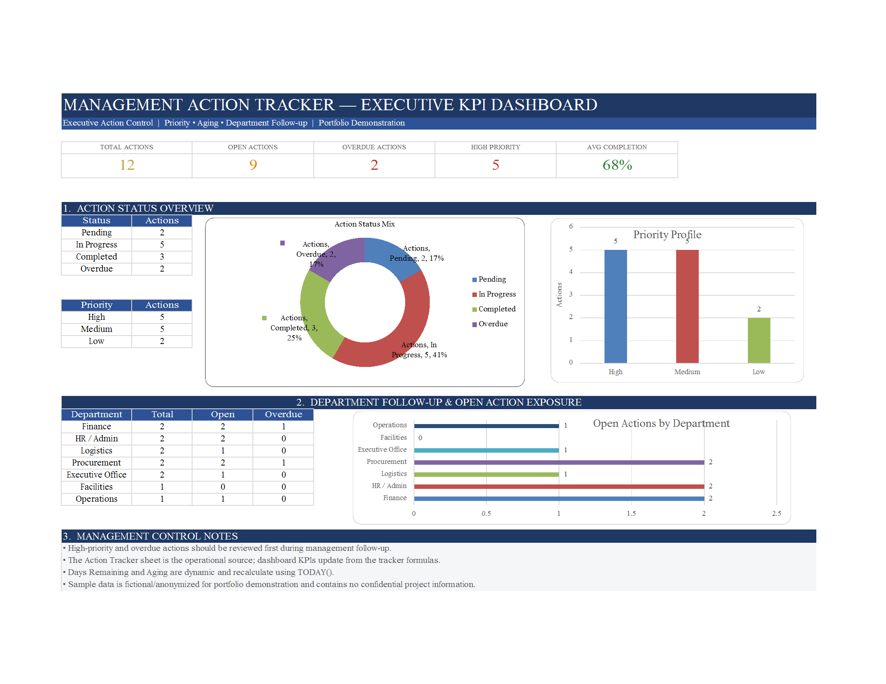

# Management Action Tracker

  

  <strong>Developed by: Sudheer Ahmed Khattak</strong> 
  Project Operations & Business Support Professional

---

## Executive Summary

The **Management Action Tracker** is an executive performance dashboard developed to help senior management monitor action items, project follow-ups, priorities, ownership, completion status, and overall execution performance.

The dashboard centralizes management actions into a structured reporting solution, providing complete visibility into outstanding tasks, aging actions, accountability, and operational progress to support faster executive decision-making.

---

## Business Objective

This dashboard was developed to help management:

- Track management action items
- Monitor task completion status
- Review overdue actions
- Analyze action priorities
- Improve accountability
- Monitor departmental follow-up
- Support executive reporting
- Enhance operational governance

---

## Dashboard Highlights

This dashboard includes:

- Executive Action Overview
- Action Status Analysis
- Priority Profile
- Aging Analysis
- Department-wise Follow-up
- Owner Performance Monitoring
- Executive KPI Cards
- Action Completion Summary
- Operational Performance Dashboard
- Executive Decision Support

---

## Key Performance Indicators (KPIs)

The dashboard reports:

- Total Actions
- Open Actions
- Overdue Actions
- High Priority Actions
- Average Completion Rate
- Pending Actions
- In Progress Actions
- Completed Actions
- Action Aging
- Executive Performance KPIs

---

## Tools & Technologies

- Microsoft Excel
- Executive Dashboard Design
- Advanced Excel
- KPI Reporting
- Management Reporting
- Business Intelligence
- Executive Reporting
- Data Visualization
- Operational Analytics

---

## Project Deliverables

This project package includes:

- Interactive Executive Dashboard
- Executive PDF Preview
- Dashboard Preview Image
- Project Documentation

---

## Skills Demonstrated

- Executive Reporting
- Management Reporting
- Action Tracking
- Dashboard Design
- KPI Reporting
- Operational Reporting
- Business Intelligence
- Data Visualization
- Performance Monitoring
- Decision Support

---

> **⚠️ Portfolio Demonstration Notice**
>
> All dashboards, reports, documents, and datasets in this repository are created solely for portfolio demonstration purposes using independently developed sample or anonymized data. No official company data or confidential information is included.

---

## Author

**Sudheer Ahmed Khattak**

Project Operations & Business Support Professional

- 🌐 [Professional Portfolio](https://sites.google.com/view/sudheer-ahmed)
- 💼 [LinkedIn Profile](https://www.linkedin.com/in/sudheer-ahmed-khattak)
- 📧 [Email](mailto:khattaksudheer@gmail.com)

---

## Project Downloads

Use the direct-download links below. Files that cannot be previewed by GitHub will automatically download.

| Project File | Description | Access |
|---|---|---|
| 📊 Executive Dashboard | Interactive Management Action Tracker | [⬇️ Download Dashboard](https://raw.githubusercontent.com/sudheer-ahmed-khattak/Excel-Trackers-and-Management-Reports/main/Management_Action_Tracker/Management_Action_Tracker.xlsx) |
| 📄 Executive PDF Preview | Printable dashboard preview | [⬇️ Download PDF Preview](https://raw.githubusercontent.com/sudheer-ahmed-khattak/Excel-Trackers-and-Management-Reports/main/Management_Action_Tracker/Management_Action_Tracker_Preview.pdf) |
| 🖼️ Dashboard Preview | High-resolution dashboard preview | [👁️ View Preview](https://raw.githubusercontent.com/sudheer-ahmed-khattak/Excel-Trackers-and-Management-Reports/main/Management_Action_Tracker/Management_Action_Tracker_Preview.png) |

---

<a href="https://github.com/sudheer-ahmed-khattak">
<strong>⬅ BACK TO GITHUB PORTFOLIO</strong>
</a>

