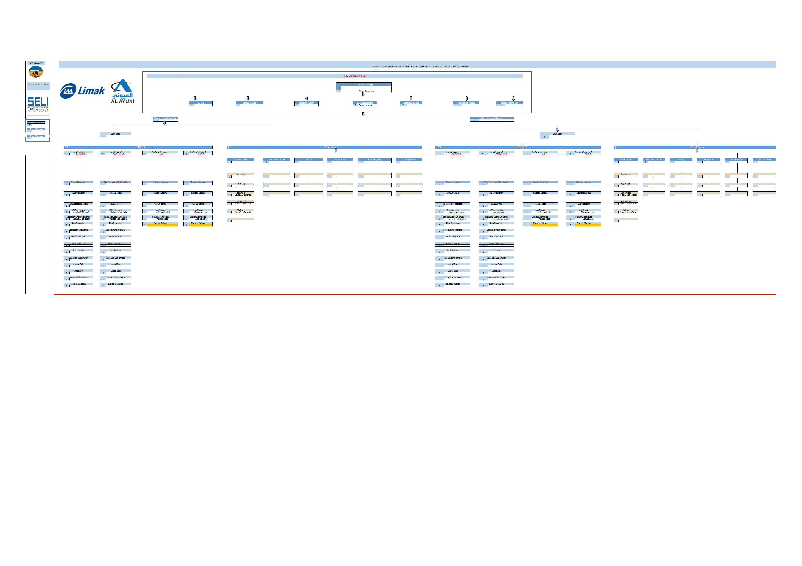

# Project Organizational Structure Chart

  

  <strong>Developed by: Sudheer Ahmed Khattak</strong> 
  Project Operations & Business Support Professional

---

## Executive Summary

The **Project Organizational Structure Chart** is a professionally designed organizational hierarchy that provides management with a clear visual representation of project leadership, reporting relationships, functional departments, and organizational governance.

The structure is designed to improve communication, accountability, reporting clarity, and executive understanding of project organization while supporting effective management and decision-making.

---

## Business Objective

This organizational structure was developed to help management:

- Visualize project hierarchy
- Define reporting relationships
- Clarify management responsibilities
- Improve organizational communication
- Support executive planning
- Present departmental structure
- Improve governance visibility
- Enhance leadership reporting

---

## Organizational Highlights

This structure includes:

- Executive Leadership
- Project Director Hierarchy
- Department Structure
- Functional Teams
- Reporting Relationships
- Organizational Governance
- Management Levels
- Operational Departments
- Leadership Responsibilities
- Project Organization Overview

---

## Key Components

The organizational chart demonstrates:

- Executive Management
- Department Heads
- Functional Reporting Lines
- Project Leadership
- Team Structure
- Organizational Hierarchy
- Reporting Channels
- Business Units
- Operational Teams
- Management Governance

---

## Tools & Technologies

- Microsoft Excel
- Organizational Chart Design
- Executive Reporting
- Project Administration
- Organizational Planning
- Management Reporting
- Business Documentation
- Process Visualization
- Leadership Reporting

---

## Project Deliverables

This project package includes:

- Organizational Structure Chart
- Organizational Chart Preview

---

## Skills Demonstrated

- Organizational Design
- Executive Reporting
- Project Administration
- Business Documentation
- Leadership Support
- Organizational Planning
- Management Reporting
- Process Visualization
- Corporate Communication
- Project Governance

---

> **⚠️ Portfolio Demonstration Notice**
>
> All dashboards, reports, documents, and datasets in this repository are created solely for portfolio demonstration purposes using independently developed sample or anonymized data. No official company data or confidential information is included.

---

## Author

**Sudheer Ahmed Khattak**

Project Operations & Business Support Professional

- 🌐 [Professional Portfolio](https://sites.google.com/view/sudheer-ahmed)
- 💼 [LinkedIn Profile](https://www.linkedin.com/in/sudheer-ahmed-khattak)
- 📧 [Email](mailto:khattaksudheer@gmail.com)

---

## Project Downloads

Use the direct-download links below. Files that cannot be previewed by GitHub will automatically download directly to your device.

| Project File | Description | Access |
|---|---|---|
| 📊 Excel Structure Chart | Complete organizational structure chart in `.xlsx` format | [⬇️ Download Excel Chart](https://github.com/sudheer-ahmed-khattak/Excel-Trackers-and-Management-Reports/raw/main/Project_Organizational_Structure_Chart/Project_Organizational_Structure_Chart.xlsx) |
| 📄 Executive PDF Report | PDF version of the organizational chart for quick review | [⬇️ Download PDF Report](https://github.com/sudheer-ahmed-khattak/Excel-Trackers-and-Management-Reports/raw/main/Project_Organizational_Structure_Chart/Project_Organizational_Structure_Chart.pdf) |
| 🖥️ Structure Chart Preview | High-resolution preview of the organizational chart | [👁️ View Structure Chart](https://raw.githubusercontent.com/sudheer-ahmed-khattak/Excel-Trackers-and-Management-Reports/main/Project_Organizational_Structure_Chart/Project_Organizational_Structure_Chart_Preview.png) |

---

&nbsp;&nbsp;&nbsp;&nbsp;&nbsp;&nbsp;&nbsp;&nbsp;
📊 **[DOWNLOAD EXCEL CHART](https://github.com/sudheer-ahmed-khattak/Excel-Trackers-and-Management-Reports/raw/main/Project_Organizational_Structure_Chart/Project_Organizational_Structure_Chart.xlsx)** &nbsp; | &nbsp;
📄 **[DOWNLOAD PDF REPORT](https://github.com/sudheer-ahmed-khattak/Excel-Trackers-and-Management-Reports/raw/main/Project_Organizational_Structure_Chart/Project_Organizational_Structure_Chart.pdf)** &nbsp; | &nbsp;
🖥️ **[VIEW STRUCTURE CHART](https://raw.githubusercontent.com/sudheer-ahmed-khattak/Excel-Trackers-and-Management-Reports/main/Project_Organizational_Structure_Chart/Project_Organizational_Structure_Chart_Preview.png)**

---

<a href="https://github.com/sudheer-ahmed-khattak">
<strong>⬅️ BACK TO GITHUB PORTFOLIO</strong>
</a>

