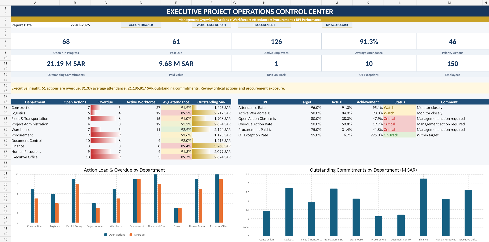
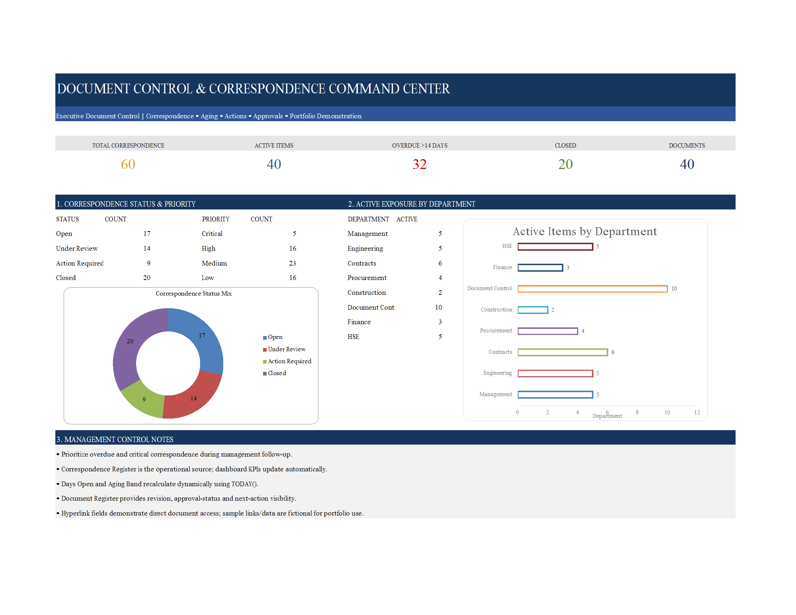
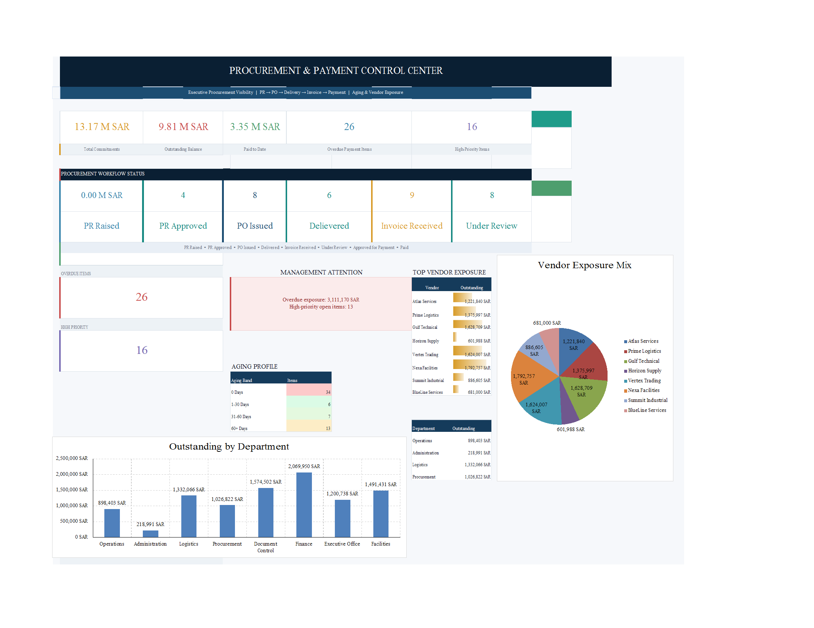
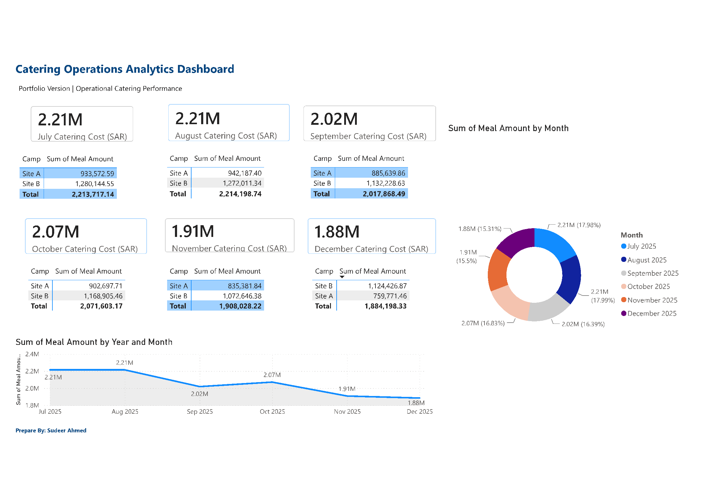

# Executive Reporting, Power BI & Management Reporting Portfolio

Welcome to my professional portfolio showcasing Power BI dashboards, executive reporting solutions, management reporting, and Excel-based operational trackers developed using real-world business scenarios.

This repository demonstrates reporting, analytics, and dashboard development skills relevant to Executive Support, Project Administration, PMO Support, Operations Coordination, and Management Reporting roles.

---

# 👨‍💼 About Me

**Sudheer Ahmed**

Senior Administrative & Project Operations Professional with 12+ years of experience in Executive Support, Project Administration, Operations Reporting, KPI Reporting, and Business Analytics.

### Core Skills

- Power BI Reporting
- Executive Dashboards
- KPI Reporting
- Management Reporting
- Project Administration
- PMO Support
- Microsoft Excel
- Power Query
- Data Analysis
- Operational Reporting
- Executive Decision Support

---

# 📂 Portfolio Projects

---

# 1. Executive Operations & Workforce KPI Dashboard (Power BI)

Interactive executive dashboard for workforce performance, attendance, overtime, and operational KPI reporting.

### Key Features

- Executive KPI Cards
- Attendance Monitoring
- Workforce Analytics
- Overtime Analysis
- Department Performance
- Interactive Power BI Dashboard

### Project Files

- 📊 [Power BI Dashboard](Executive_Operations_Workforce_KPI_Dashboard.pbix)
- 📄 [PDF Version](Executive_Operations_Workforce_KPI_Dashboard.pdf)

---

# 2. Executive Project Operations Control Center

Excel-based operational control center supporting executive project monitoring and reporting.

### Key Features

- Executive KPIs
- Operational Dashboard
- Department Summary
- Project Monitoring
- Management Reporting

### Project Files

- 📄 Excel Dashboard
- 🖼 Preview Included

---

# 3. Management Action Tracker

Professional action tracking solution for monitoring assignments, priorities, ownership, and completion status.

### Key Features

- Action Register
- Priority Tracking
- Status Monitoring
- Executive Dashboard
- Performance Reporting

### Project Files

- 📄 Excel Dashboard
- 🖼 Preview Included

---

# 4. Document Control & Correspondence Command Center

Document control reporting solution for correspondence tracking and management reporting.

### Key Features

- Correspondence Register
- Revision Tracking
- Aging Analysis
- Status Monitoring
- Executive Reporting

### Project Files

- 📄 Excel Dashboard
- 🖼 Preview Included

---

# 5. Executive Management Reporting & Board Support Portfolio

Professional executive reporting presentation demonstrating board support and management reporting capabilities.

### Key Features

- Executive Reporting
- Board Support
- KPI Presentations
- Management Dashboards
- Business Reporting

### Project Files

- 📄 PowerPoint Portfolio
- 🖼 Preview Included

---

# 6. Procurement & Payment Control Center

Procurement reporting dashboard for purchase orders, invoices, payment tracking, and executive reporting.

### Key Features

- Procurement KPIs
- Payment Monitoring
- Purchase Orders
- Invoice Tracking
- Executive Dashboard

### Project Files

- 📄 Excel Dashboard
- 🖼 Preview Included

---

# 7. Catering Operations Analytics Dashboard (Power BI)

Power BI dashboard developed for catering operations reporting, monthly catering cost analysis, and operational performance monitoring.

### Key Features

- Catering Cost Analysis
- Monthly Trend Analysis
- Camp Comparison
- Interactive Dashboard
- Executive Reporting

### Project Files

- 📊 [Power BI Dashboard](Catering_Operations_Analytics_Dashboard.pbix)
- 📄 [PDF Version](Catering_Operations_Analytics_Dashboard.pdf)

---

# 💻 Technical Skills Demonstrated

## Microsoft Power BI

- Dashboard Development
- Power Query
- Data Modeling
- DAX
- KPI Reporting
- Interactive Visualizations
- Executive Dashboards

## Microsoft Excel

- Dashboard Development
- Advanced Formulas
- Pivot Tables
- Conditional Formatting
- Power Query
- Data Analysis
- Reporting Automation

## Reporting & Analytics

- Executive Reporting
- Management Reporting
- KPI Reporting
- Operational Reporting
- Workforce Reporting
- Procurement Reporting
- Project Reporting
- Business Analytics

---

# 🛠 Software & Tools

- Microsoft Power BI
- Microsoft Excel
- Power Query
- DAX
- Oracle Fusion
- Oracle Cloud
- Aconex
- Microsoft PowerPoint

---

# 🎯 Target Roles

This portfolio supports applications for:

- Executive Assistant
- Senior Administrative Assistant
- Project Administrator
- Project Coordinator
- PMO Support
- Office Manager
- Business Support Specialist
- Operations Coordinator
- Reporting Analyst
- Power BI Reporting Analyst
- Management Reporting Specialist
- Executive Reporting Analyst

---

# ⚠️ Disclaimer

All dashboards and reports are presented for portfolio purposes only.

Business data has been anonymized or modified to protect confidentiality while demonstrating reporting, dashboard development, and analytical capabilities.

---

# 📧 Contact

**Sudheer Ahmed**

📧 Email: khattaksudheer@gmail.com

🔗 LinkedIn
https://www.linkedin.com/in/sudheer-ahmed-khattak

🌐 Portfolio
https://sites.google.com/view/sudheer-ahmed
