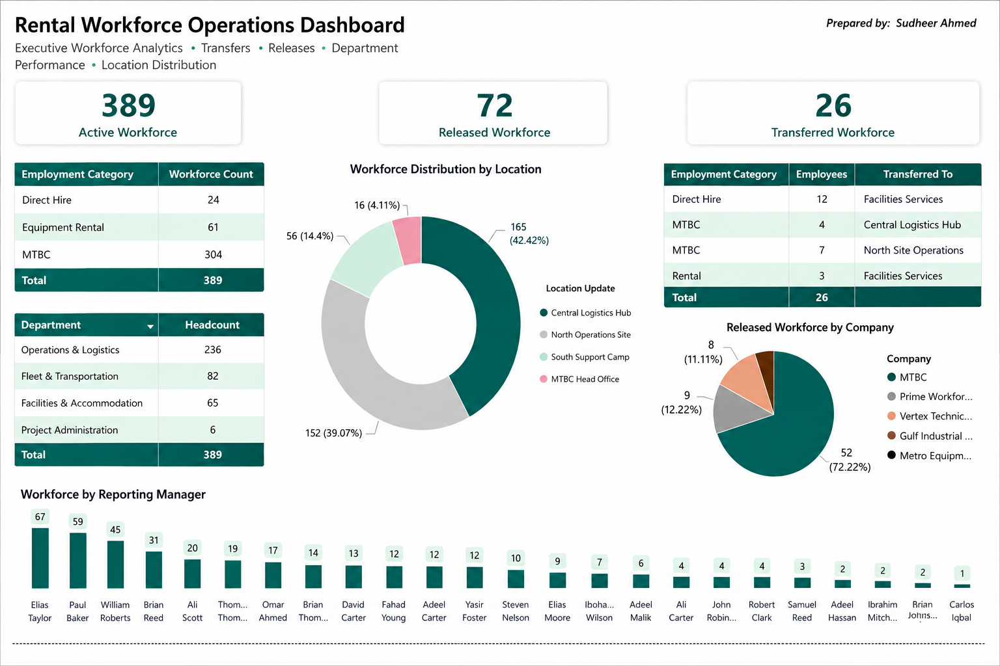

# Rental Workforce Operations Dashboard

  

  <strong>Developed by: Sudheer Ahmed Khattak</strong> 
  Project Operations & Business Support Professional

---

## Executive Summary

The **Rental Workforce Operations Dashboard** is an executive Power BI reporting solution developed to provide management with clear visibility into active workforce, employee releases, internal transfers, department-level headcount, workforce locations, employment categories, reporting lines, and company-wise manpower distribution.

The dashboard consolidates workforce information into a single executive view, enabling management to monitor workforce movement, identify operational concentration, review transfer activity, assess released manpower, and support workforce planning decisions.

---

## Business Objective

This dashboard was developed to help management:

- Monitor active rental workforce
- Track released employees
- Review workforce transfers
- Analyze employment categories
- Monitor department-level headcount
- Review workforce distribution by location
- Assess released workforce by company
- Monitor reporting-manager workforce allocation
- Improve manpower visibility
- Support executive workforce planning
- Strengthen operational decision-making

---

## Dashboard Highlights

This dashboard includes:

- Executive Workforce Overview
- Active Workforce Monitoring
- Released Workforce Tracking
- Transferred Workforce Tracking
- Employment Category Summary
- Department Headcount Analysis
- Workforce Distribution by Location
- Workforce Transfer Details
- Released Workforce by Company
- Workforce by Reporting Manager
- Executive KPI Cards
- Management-Level Workforce Reporting

---

## Key Performance Indicators (KPIs)

The dashboard reports:

- Active Workforce
- Released Workforce
- Transferred Workforce
- Direct Hire Workforce
- Equipment Rental Workforce
- MTBC Workforce
- Department Headcount
- Workforce by Location
- Workforce by Reporting Manager
- Employees Transferred by Category
- Released Workforce by Company
- Total Workforce Distribution

---

## Tools & Technologies

- Microsoft Power BI
- Microsoft Excel
- Power Query
- Data Modeling
- DAX
- Executive Dashboard Design
- Workforce Analytics
- KPI Reporting
- Business Intelligence
- Data Visualization
- Executive Reporting

---

## Project Deliverables

This project package includes:

- Interactive Power BI Dashboard
- Excel Source Dataset
- Executive PDF Report
- Dashboard Preview
- Project Documentation

---

## Skills Demonstrated

- Workforce Analytics
- Manpower Reporting
- Executive Reporting
- Power BI Dashboard Development
- Data Modeling
- Power Query
- DAX
- KPI Reporting
- Department-Level Analysis
- Transfer Monitoring
- Release Tracking
- Data Visualization
- Business Intelligence
- Management Reporting

---

> **⚠️ Portfolio Demonstration Notice**
>
> All dashboards, reports, documents, and datasets in this repository are created solely for portfolio demonstration purposes using independently developed sample or anonymized data. No official company data or confidential information is included.

---

## Author

**Sudheer Ahmed Khattak**

Project Operations & Business Support Professional

- 🌐 [Professional Portfolio](https://sites.google.com/view/sudheer-ahmed)
- 💼 [LinkedIn Profile](https://www.linkedin.com/in/sudheer-ahmed-khattak)
- 📧 [Email](mailto:khattaksudheer@gmail.com)

---

## Project Downloads

Use the direct-download links below. Files that cannot be previewed by GitHub will automatically download directly to your device.

| Project File | Description | Access |
|---|---|---|
| 📊 Power BI Dashboard | Complete interactive workforce dashboard in `.pbix` format | [⬇️ Download Power BI Dashboard](https://github.com/sudheer-ahmed-khattak/Excel-Trackers-and-Management-Reports/raw/main/Rental_Workforce_Operations_Dashboard/Rental_Workforce_Operations_Dashboard.pbix) |
| 📈 Excel Source Data | Anonymized workforce source dataset in `.xlsx` format | [⬇️ Download Excel Source Data](https://github.com/sudheer-ahmed-khattak/Excel-Trackers-and-Management-Reports/raw/main/Rental_Workforce_Operations_Dashboard/Rental_Workforce_Operations_Dashboard_Data.xlsx) |
| 📄 Executive PDF Report | PDF version of the dashboard for quick review | [⬇️ Download PDF Report](https://github.com/sudheer-ahmed-khattak/Excel-Trackers-and-Management-Reports/raw/main/Rental_Workforce_Operations_Dashboard/Rental_Workforce_Operations_Dashboard.pdf) |
| 🖥️ Dashboard Preview | High-resolution preview of the dashboard | [👁️ View Dashboard](https://raw.githubusercontent.com/sudheer-ahmed-khattak/Excel-Trackers-and-Management-Reports/main/Rental_Workforce_Operations_Dashboard/Rental_Workforce_Operations_Dashboard_Preview.png) |

---

&nbsp;&nbsp;&nbsp;&nbsp;&nbsp;&nbsp;&nbsp;&nbsp;
📊 **[DOWNLOAD POWER BI DASHBOARD](https://github.com/sudheer-ahmed-khattak/Excel-Trackers-and-Management-Reports/raw/main/Rental_Workforce_Operations_Dashboard/Rental_Workforce_Operations_Dashboard.pbix)** &nbsp; | &nbsp;
📈 **[DOWNLOAD EXCEL SOURCE DATA](https://github.com/sudheer-ahmed-khattak/Excel-Trackers-and-Management-Reports/raw/main/Rental_Workforce_Operations_Dashboard/Rental_Workforce_Operations_Dashboard_Data.xlsx)** &nbsp; | &nbsp;
📄 **[DOWNLOAD PDF REPORT](https://github.com/sudheer-ahmed-khattak/Excel-Trackers-and-Management-Reports/raw/main/Rental_Workforce_Operations_Dashboard/Rental_Workforce_Operations_Dashboard.pdf)** &nbsp; | &nbsp;
🖥️ **[VIEW DASHBOARD](https://raw.githubusercontent.com/sudheer-ahmed-khattak/Excel-Trackers-and-Management-Reports/main/Rental_Workforce_Operations_Dashboard/Rental_Workforce_Operations_Dashboard_Preview.png)**

---

<a href="https://github.com/sudheer-ahmed-khattak">
<strong>⬅ BACK TO GITHUB PORTFOLIO</strong>
</a>

