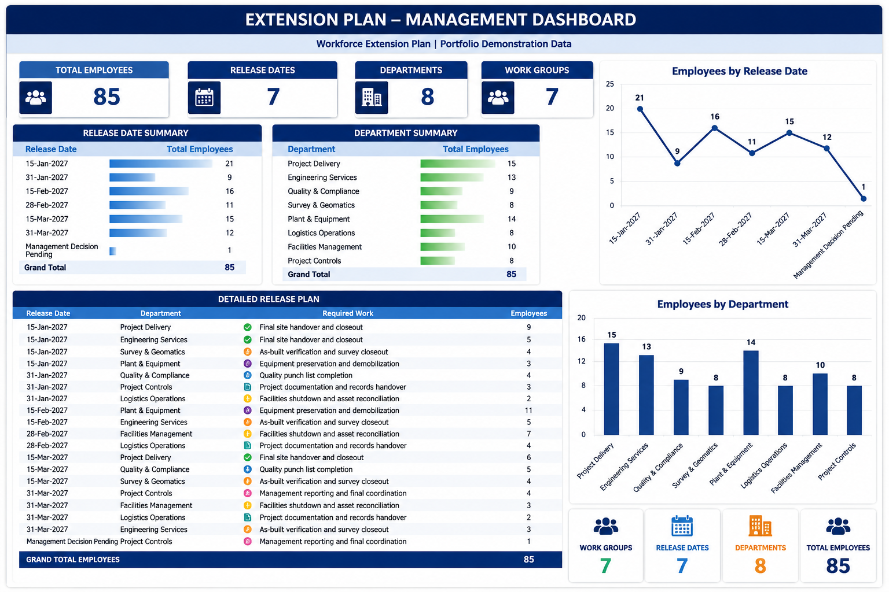

# Workforce Extension Planning Dashboard

  

  <strong>Developed by: Sudheer Ahmed Khattak</strong> 
  Project Operations & Business Support Professional

---

## Executive Summary

The **Workforce Extension Planning Dashboard** is an executive workforce planning solution developed to provide management with a clear and centralized overview of employee extension requirements, release schedules, departmental workforce distribution, required work activities, and management decision points.

The dashboard transforms workforce planning data into structured management insights, enabling project leadership to monitor employee release timelines, review departmental requirements, identify pending decisions, and support effective workforce demobilization and closeout planning.

---

## Business Objective

This dashboard was developed to help management:

- Monitor workforce extension requirements
- Review employee release schedules
- Track departmental workforce distribution
- Identify management decisions pending
- Monitor work groups and required activities
- Support project closeout planning
- Improve workforce visibility
- Support executive decision-making

---

## Dashboard Highlights

This dashboard includes:

- Workforce Extension Overview
- Total Employee Summary
- Release Date Summary
- Department Summary
- Detailed Release Plan
- Required Work Analysis
- Employees by Release Date
- Employees by Department
- Executive KPI Cards
- Management Decision Visibility

---

## Key Performance Indicators (KPIs)

The dashboard reports:

- Total Employees
- Total Release Dates
- Total Departments
- Total Work Groups
- Employees by Release Date
- Employees by Department
- Departmental Workforce Distribution
- Pending Management Decisions
- Required Work Activities
- Workforce Extension Status

---

## Tools & Technologies

- Microsoft Excel
- Executive Dashboard Design
- Advanced Excel
- Workforce Planning
- KPI Reporting
- Management Reporting
- Project Closeout Planning
- Data Visualization
- Business Intelligence

---

## Project Deliverables

This project package includes:

- Interactive Workforce Extension Dashboard
- Executive PDF Report
- Dashboard Preview
- Project Documentation

---

## Skills Demonstrated

- Workforce Planning
- Executive Reporting
- Dashboard Design
- KPI Reporting
- Departmental Analysis
- Release Planning
- Project Closeout Support
- Management Reporting
- Data Visualization
- Business Intelligence

---

> **⚠️ Portfolio Demonstration Notice**
>
> All dashboards, reports, documents, employee records, organizations, figures, and datasets in this repository are created solely for professional portfolio demonstration purposes using independently developed synthetic or anonymized data. No official company data or confidential information is included.

---

## Author

**Sudheer Ahmed Khattak**

Project Operations & Business Support Professional

- 🌐 [Professional Portfolio](https://sites.google.com/view/sudheer-ahmed)
- 💼 [LinkedIn Profile](https://www.linkedin.com/in/sudheer-ahmed-khattak)
- 📧 [Email](mailto:khattaksudheer@gmail.com)

---

## Project Downloads

Use the direct-download links below. Files that cannot be previewed by GitHub will automatically download directly to your device.

| Project File | Description | Access |
|---|---|---|
| 📊 Excel Dashboard | Complete interactive Workforce Extension Planning Dashboard in `.xlsx` format | [⬇️ Download Excel Dashboard](https://github.com/sudheer-ahmed-khattak/Excel-Trackers-and-Management-Reports/raw/main/Workforce_Extension_Planning_Dashboard/Workforce_Extension_Planning_Dashboard.xlsx) |
| 📄 Executive PDF Report | PDF version of the dashboard for quick review | [⬇️ Download PDF Report](https://github.com/sudheer-ahmed-khattak/Excel-Trackers-and-Management-Reports/raw/main/Workforce_Extension_Planning_Dashboard/Workforce_Extension_Planning_Dashboard.pdf) |
| 🖥️ Dashboard Preview | High-resolution preview of the dashboard | [👁️ View Dashboard](https://raw.githubusercontent.com/sudheer-ahmed-khattak/Excel-Trackers-and-Management-Reports/main/Workforce_Extension_Planning_Dashboard/Workforce_Extension_Planning_Dashboard_Preview.png) |

---

📊 **[DOWNLOAD EXCEL DASHBOARD](https://github.com/sudheer-ahmed-khattak/Excel-Trackers-and-Management-Reports/raw/main/Workforce_Extension_Planning_Dashboard/Workforce_Extension_Planning_Dashboard.xlsx)** &nbsp; | &nbsp;
📄 **[DOWNLOAD PDF REPORT](https://github.com/sudheer-ahmed-khattak/Excel-Trackers-and-Management-Reports/raw/main/Workforce_Extension_Planning_Dashboard/Workforce_Extension_Planning_Dashboard.pdf)** &nbsp; | &nbsp;
🖥️ **[VIEW DASHBOARD](https://raw.githubusercontent.com/sudheer-ahmed-khattak/Excel-Trackers-and-Management-Reports/main/Workforce_Extension_Planning_Dashboard/Workforce_Extension_Planning_Dashboard_Preview.png)**

---

<a href="https://github.com/sudheer-ahmed-khattak">
<strong>⬅️ BACK TO GITHUB PORTFOLIO</strong>
</a>

