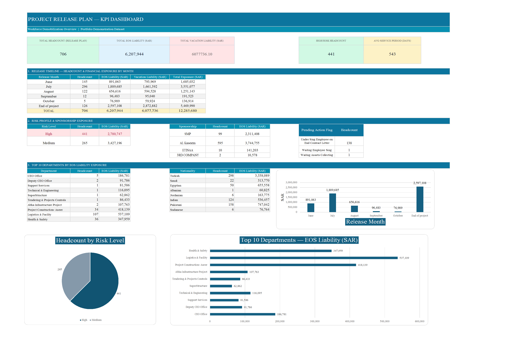

# Workforce Release Planning & EOS Dashboard

  

  <strong>Developed by: Sudheer Ahmed Khattak</strong> 
  Project Operations & Business Support Professional

---

## Executive Summary

The **Workforce Release Planning & EOS Dashboard** is an executive workforce planning solution developed to help management monitor employee release plans, End-of-Service (EOS) liabilities, sponsorship exposure, departmental workforce distribution, and workforce risk indicators through a centralized executive dashboard.

The dashboard transforms workforce data into meaningful KPIs and executive reports, enabling management to evaluate financial obligations, optimize workforce planning, monitor departmental exposure, and support strategic decision-making.

---

## Business Objective

This dashboard was developed to help management:

- Monitor workforce release plans
- Track End-of-Service (EOS) liabilities
- Analyze departmental workforce distribution
- Monitor sponsorship exposure
- Identify workforce risk levels
- Review employee release status
- Support manpower planning
- Improve financial visibility
- Enable executive decision-making

---

## Dashboard Highlights

This dashboard includes:

- Executive Workforce Overview
- Release Planning Dashboard
- EOS Liability Analysis
- Departmental Workforce Summary
- Sponsorship Distribution
- Workforce Risk Profile
- Nationality Distribution
- Executive KPI Cards
- Workforce Exposure Analysis
- Interactive Dashboard Filters

---

## Key Performance Indicators (KPIs)

The dashboard reports:

- Total Employees
- Total EOS Liability
- Average EOS Liability
- High Risk Employees
- Medium Risk Employees
- Sponsorship Distribution
- Department Headcount
- EOS Liability by Department
- Nationality Distribution
- Planned Employee Releases
- Workforce Exposure
- Executive Workforce Summary

---

## Tools & Technologies

- Microsoft Excel
- Advanced Excel Formulas
- Executive Dashboard Design
- KPI Reporting
- Workforce Analytics
- EOS Liability Reporting
- Executive Reporting
- Business Intelligence
- Data Visualization

---

## Project Deliverables

This project package includes:

- Interactive Workforce Dashboard
- Dashboard Preview
- Project Documentation

---

## Skills Demonstrated

- Workforce Analytics
- Executive Reporting
- Dashboard Design
- KPI Reporting
- EOS Liability Analysis
- Workforce Planning
- Department Performance Analysis
- Business Intelligence
- Data Visualization
- Management Reporting

---

> **⚠️ Portfolio Demonstration Notice**
>
> All dashboards, reports, documents, and datasets in this repository are created solely for portfolio demonstration purposes using independently developed sample or anonymized data. No official company data or confidential information is included.

---

## Author

**Sudheer Ahmed Khattak**

Project Operations & Business Support Professional

- 🌐 [Professional Portfolio](https://sites.google.com/view/sudheer-ahmed)
- 💼 [LinkedIn Profile](https://www.linkedin.com/in/sudheer-ahmed-khattak)
- 📧 [Email](mailto:khattaksudheer@gmail.com)

---

## Project Downloads

Use the direct-download links below. Files that cannot be previewed by GitHub will automatically download directly to your device.

| Project File | Description | Access |
|---|---|---|
| 📊 Excel Dashboard | Complete interactive Workforce Release Planning & EOS Dashboard in `.xlsx` format | [⬇️ Download Excel Dashboard](https://github.com/sudheer-ahmed-khattak/Excel-Trackers-and-Management-Reports/raw/main/Workforce_Release_Planning_EOS_Dashboard/Workforce_Release_Planning_EOS_Dashboard.xlsx) |
| 📄 Executive PDF Report | PDF version of the dashboard for quick review | [⬇️ Download PDF Report](https://github.com/sudheer-ahmed-khattak/Excel-Trackers-and-Management-Reports/raw/main/Workforce_Release_Planning_EOS_Dashboard/Workforce_Release_Planning_EOS_Dashboard_Report.pdf) |
| 🖥️ Dashboard Preview | High-resolution preview of the dashboard | [👁️ View Dashboard](https://raw.githubusercontent.com/sudheer-ahmed-khattak/Excel-Trackers-and-Management-Reports/main/Workforce_Release_Planning_EOS_Dashboard/Workforce_Release_Planning_EOS_Dashboard_Preview.png) |

---

&nbsp;&nbsp;&nbsp;&nbsp;&nbsp;&nbsp;&nbsp;&nbsp;
📊 **[DOWNLOAD EXCEL DASHBOARD](https://github.com/sudheer-ahmed-khattak/Excel-Trackers-and-Management-Reports/raw/main/Workforce_Release_Planning_EOS_Dashboard/Workforce_Release_Planning_EOS_Dashboard.xlsx)** &nbsp; | &nbsp;
📄 **[DOWNLOAD PDF REPORT](https://github.com/sudheer-ahmed-khattak/Excel-Trackers-and-Management-Reports/raw/main/Workforce_Release_Planning_EOS_Dashboard/Workforce_Release_Planning_EOS_Dashboard_Report.pdf)** &nbsp; | &nbsp;
🖥️ **[VIEW DASHBOARD](https://raw.githubusercontent.com/sudheer-ahmed-khattak/Excel-Trackers-and-Management-Reports/main/Workforce_Release_Planning_EOS_Dashboard/Workforce_Release_Planning_EOS_Dashboard_Preview.png)**

---

<a href="https://github.com/sudheer-ahmed-khattak">
<strong>⬅ BACK TO GITHUB PORTFOLIO</strong>
</a>

